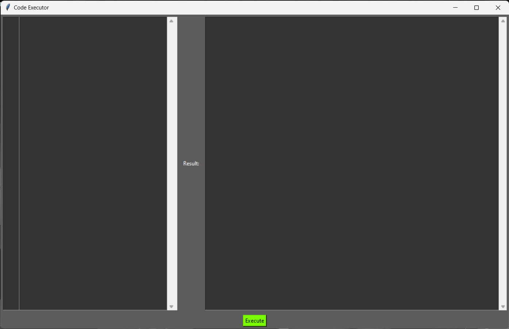
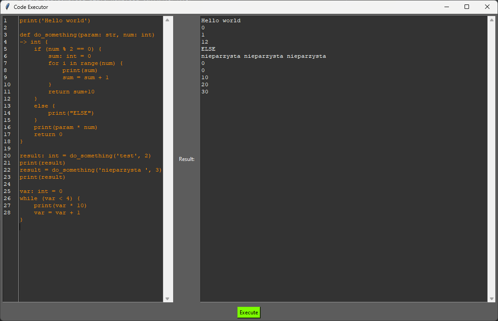
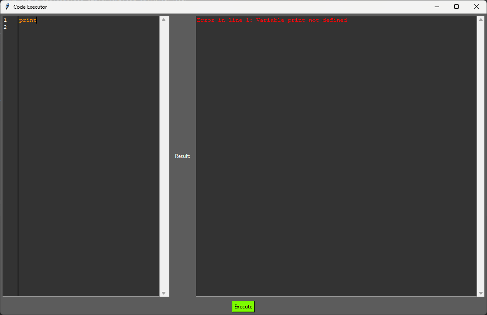

# TKiK Projekt - Interpreter Python ze statycznym typowaniem 
## Autorzy: Jan Mardyła, Agata Marczyk
<details><summary>Dane kontaktowe</summary>
<ul>
    <li>agatamarczyk@student.agh.edu.pl</li> 
    <li>mardyla@student.agh.edu.pl</li>
</ul>
</details>

## Założenia Projektu 
<ul>
    <li>Stworzenie interpretera języka Python ze statycznym typowaniem oraz dodanymi nawiasami klamrowymi "{}" zastępującymi wcięcia kodu</li>
    <li>Rodzaj translatora: Interpreter</li>
    <li>Język implementaji: Python</li>
    <li>Wykorzystywany generator parserów: ANTLR</li>
</ul>

## Tokeny
```g4
// Tokes
// Tokens
NUMBER: '-'? ( '0' | [1-9] [0-9]* ) ( '.' [0-9]+ )? ( ('e' | 'E') [+-]? [0-9]+ )?;
STRING: '"' ( '\\' . | ~["\\] )* '"' | '\'' ( '\\' . | ~['\\] )* '\'';
TYPE_ANNOTATION: '->';
IN: 'in';
COLON: ':';
COMMA: ',';
SEMI: ';';
PLUS: '+';
MINUS: '-';
STAR: '*';
SLASH: '/';
VBAR: '|';
AMPERSAND: '&'; // Fixed token name
LESS: '<';
GREATER: '>';
EQUAL: '=';
DOT: '.';
PERCENT: '%';
EQEQUAL: '==';
NOTEQUAL: '!=';
LESSEQUAL: '<=';
GREATEREQUAL: '>=';
TILDE: '~';
PLUSEQUAL: '+=';
MINEQUAL: '-=';
STAREQUAL: '*=';
SLASHEQUAL: '/=';
PERCENTEQUAL: '%=';
EXCLAMATION: '!';
NULL: 'null';
DECIMALINTLITERAL: '0' | [1-9] [0-9]*;

// Keywords
BREAK: 'break';
ELSE: 'else';
RETURN: 'return';
CONTINUE: 'continue';
DEF: 'def';
IF: 'if';
WHILE: 'while';
FOR: 'for';
CLASS: 'class';

// Comments
COMMENT: '#' ~[\r\n]* -> skip;

// Delimiters
OPEN_PAREN: '(';
CLOSE_PAREN: ')';
OPEN_BRACKET: '[';
CLOSE_BRACKET: ']';
OPEN_BRACE: '{';
CLOSE_BRACE: '}';

// Type annotations
INT: 'int';
STR: 'str';
FLOAT: 'float';
COMPLEX: 'complex';
BOOLEAN: 'bool';
LIST: 'list';
TUPLE: 'tuple';
DICT: 'dict';
SET: 'set';
IDENTIFIER: [a-zA-Z_][a-zA-Z0-9_]*;

NEWLINE: '\r'? '\n';
WS: [ \t]+ -> skip;
```
## Gramatyka
```g4
program: statements EOF;

statements: NEWLINE* statement (NEWLINE+ statement)* NEWLINE*;

statement: expression_statement
         | assignment_statement
         | reassignment_statement
         | if_statement
         | while_statement
         | for_statement
         | function_definition
         | COMMENT;

function_statement: expression_statement
         | assignment_statement
         | reassignment_statement
         | if_statement
         | while_statement
         | for_statement
         | COMMENT
         | return_statement;

function_statements: NEWLINE* function_statement (NEWLINE+ function_statement)* NEWLINE*;

loop_statement: expression_statement
         | assignment_statement
         | reassignment_statement
         | if_statement
         | while_statement
         | for_statement
         | COMMENT
         | return_statement;


expression_statement : expression NEWLINE?;

assignment_statement : IDENTIFIER COLON type EQUAL expression SEMI?;

reassignment_statement : IDENTIFIER EQUAL expression SEMI?;

if_statement : IF (expression | OPEN_PAREN expression CLOSE_PAREN) OPEN_BRACE NEWLINE
               function_statements CLOSE_BRACE NEWLINE?
                (ELSE OPEN_BRACE NEWLINE function_statements CLOSE_BRACE)?;

while_statement : WHILE (expression | OPEN_PAREN expression CLOSE_PAREN) OPEN_BRACE NEWLINE statements CLOSE_BRACE;

for_statement : FOR IDENTIFIER IN expression OPEN_BRACE NEWLINE statements CLOSE_BRACE;

function_definition : DEF IDENTIFIER OPEN_PAREN typed_parameters? CLOSE_PAREN TYPE_ANNOTATION type OPEN_BRACE NEWLINE function_statements CLOSE_BRACE;

expression_list : expression (COMMA expression)*;

typed_parameters : typed_parameter (COMMA typed_parameter)*;

typed_parameter : IDENTIFIER COLON type;

return_statement : RETURN expression? SEMI?;

expression : primary (operator primary)*;

operator : PLUS
         | MINUS
         | STAR
         | SLASH
         | AMPERSAND
         | LESS
         | GREATER
         | PERCENT
         | EQEQUAL
         | NOTEQUAL
         | LESSEQUAL
         | GREATEREQUAL
         | PLUSEQUAL
         | MINEQUAL
         | STAREQUAL
         | SLASHEQUAL
         | PERCENTEQUAL;

primary : IDENTIFIER
        | NUMBER
        | STRING
        | OPEN_BRACKET expression_list CLOSE_BRACKET
        | OPEN_BRACE expression CLOSE_BRACE
        | function_call;

function_call : IDENTIFIER OPEN_PAREN expression_list? CLOSE_PAREN;

type : INT
     | STR
     | FLOAT
     | COMPLEX
     | BOOLEAN
     | LIST
     | TUPLE
     | DICT
     | SET
     | 'None';
```
## Example parse tree
```
print('Hello world')

def do_something(param: str, num: int) -> int {
    for i in range(num) {
        print(param)
    }
    return num
}

result: int = do_something('test', 3)

```


## How to use 

### Useful links: 
<details>
<ul>
    <li><a href="https://ati.ttu.ee/~kjans/antlr/pycharm_antlr4_guide.pdf">PyCharm ANTLR4 Guide</a></li>
    <li><a href="https://www.antlr.org/download.html">Download ANTLR</a></li>
    <li><a href="https://yetanotherprogrammingblog.medium.com/antlr-with-python-974c756bdb1b">ANTLR with Python</a></li>
    <li><a href="https://github.com/antlr/antlr4/blob/master/doc/tool-options.md">ANTLR Tool Command Line Options</a></li>
    <li><a href="https://github.com/jszheng/py3antlr4book/blob/master/README.md">py3antlr4book</a></li>
    <li><a href="https://github.com/antlr/antlr4/blob/master/doc/python-target.md">Python 3 - Antlr4</a></li>
</ul>
</details>

## Instrukcja obsługi: 
- sklonuj repozutorium 
<code>git clone https://github.com/jmardyla/Teoria-kompilacji-i-kompilatory.git</code>
- otwórz projekt w IDE 
- uruchom plik main.py


## przykładowe użycie 


